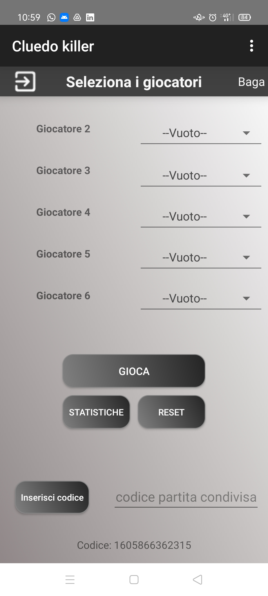
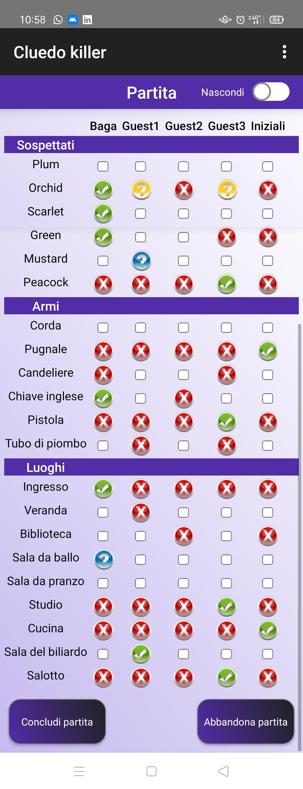
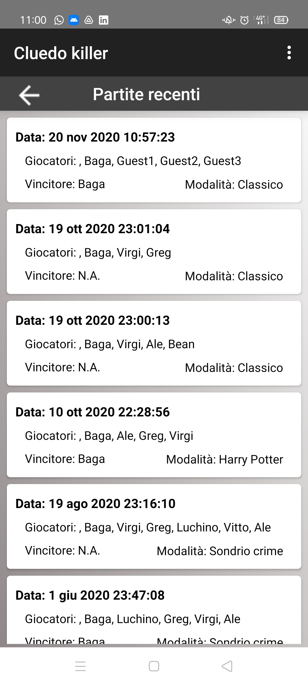
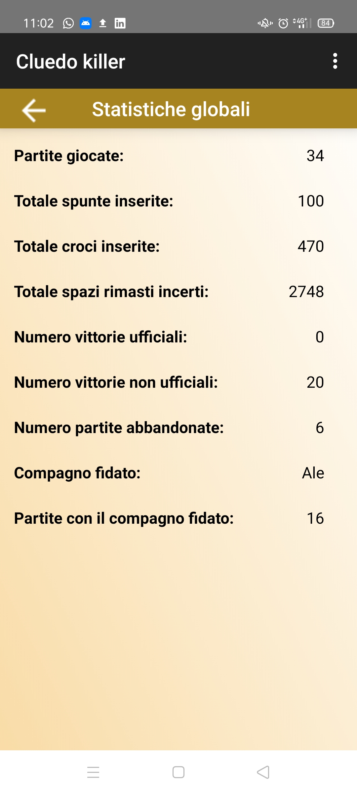

# Personalized-Cluedo-Score-Sheet

This is a personal project to implement an improved Cluedo Scoresheet with many different features like global statistics, app personalization and past games history to play standard Cluedo, Harry Potter Cluedo or even a personalized version.

Right now the app is available only for android phones, the apk can be found in the APK folder.

Following up some screens of the application.

<h2 align="center">
Select players
</h2>

  

**Score sheet**

  

**Past games history**

  

**Statistics**

  

